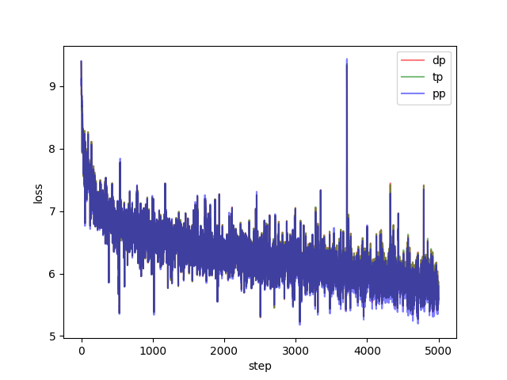
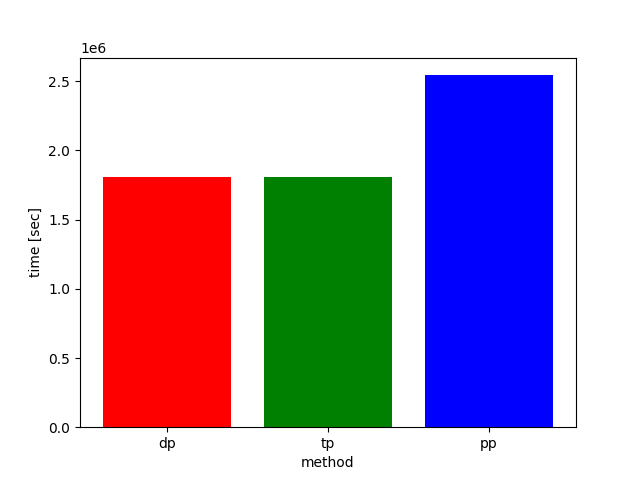

# JAX Distributed Training
This repository demonstrates various distributed training strategies implemented in JAX. To evaluate performance, we use a GPT-style architecture trained on the FineWeb-edu dataset, measuring both convergence (loss) and computational efficiency (elapsed time).

## Parallelism Strategies
JAX allows for flexible distributed computing. This project implements and compares three primary strategies:

**Data Parallel (DP)**
The model is replicated on each device, while the training data (batch axis) is partitioned across devices.

**Tensor Parallel (TP)** 
Model layers are partitioned across the feature dimension (e.g., splitting MLP weights by row or column).

**Pipeline Parallel (PP)**
The model layers are distributed sequentially across devices, with different stages of the network processing different micro-batches.

## Usage
### Install Dependencies
This project uses the uv package manager.
```bash
uv sync
```

### Run Training
Execute training via `main.py` by providing the specific configuration file for the desired strategy:

```bash
# Data Parallel
uv run main.py --train_config_path configs/train_config_dp.yaml

# Tensor Parallel
uv run main.py --train_config_path configs/train_config_tp.yaml

# Pipeline Parallel
uv run main.py --train_config_path configs/train_config_pp.yaml
```

### Results & Visualization
To generate comparison plots for training loss and execution time, run:

```bash
uv run plot.py
```

<table>
 <tr>
  <td></td>
  <td></td>
 </tr>
<table>

**Note**: While the loss remains consistent across all strategies, Pipeline Parallel (PP) typically shows higher elapsed time compared to DP and TP.